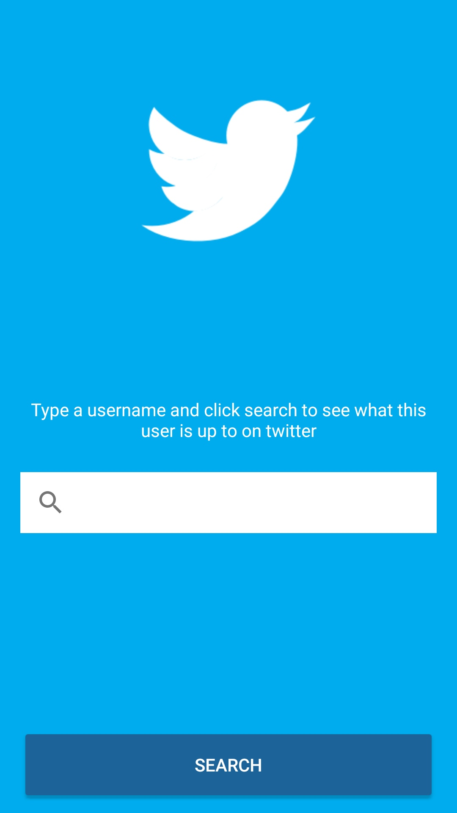

# Tweet Mood

Android native app to analyze tweets sentiments from a given user.

## Screenshots

  
  
  
  
  
  
    

## Characteristics
* Model-View-Presenter (MVP) for it's Presentation Layer
* 100% developed using Kotlin
* Design with a pleasant user interface based on Material Design principles and with beautiful yet modest animations
* Using Fabric for Crash report and Beta Deploy

## Libraries used
* Retrofit2
* Support Library
* Constraint Layout

## Future features
* Add UI tests with espresso and unit tests with roboeletric
* Change the MVP Presentation Layer to MVVM (using some libraries from Android JetPack)
* Add dependency injection such as koin, kodein or dagger2
* Add a repository layer as a "single source of true"
* Encrypt Twitter's API token before storing it (although it was stored with some protection, a user with a rooted phone would be able to find the token)

# Base information to develop the app

## Business rules
* Happy Tweet: We want a vibrant yellow color on screen with a 😃 emoji
* Neutral Tweet: We want a grey colour on screen with a 😐 emoji
* Sad Tweet: We want a blue color on screen with a 😔 emoji
* For the first release we will only support english language

### Hints
* You may use Twitter's oficial API (https://developer.twitter.com) to fetch user's tweets 
* Google's Natural Language API (https://cloud.google.com/natural-language/) may help you with sentimental analysis.

## Non functional requirements
* As this app will be a worldwide success, it must be prepared to be fault tolerant, responsive and resilient.
* Use whatever language, tools and frameworks you feel comfortable to.
* Briefly elaborate on your solution, architecture details, choice of patterns and frameworks.
* Fork this repository and submit your code.
